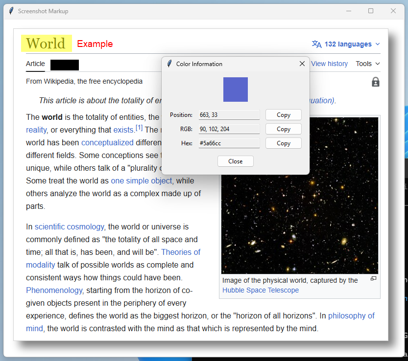

# Screenshot Markup Tool

A Windows desktop app for quickly marking up screenshots with highlight, redaction, text overlay, and color picking tools.



## Features

### Markup Tools
- **Highlighter Tool**: Draw semi-transparent yellow rectangles.
- **Redaction Tool**: Draw solid black rectangles.
- **Color Picker**: Inspect pixel position, RGB, and hex values.
- **Text Tool**: Add, drag, and edit text overlays on top of images.
- **OCR Tool**: Select a region and extract text with Tesseract.

### Editing
- Undo/redo support (up to 20 states)
- Draggable text with cursor feedback on hover
- Context-menu tool switching

### Output
- Save as **PNG** or **JPG**
- Default save format is **PNG**
- App remembers the last selected save format in a local config file
- Copy rendered result to clipboard

### Windowing
- Open additional app windows from the context menu

## Keyboard Shortcuts

| Shortcut | Action |
|----------|--------|
| Ctrl+V | Paste image from clipboard |
| Ctrl+C | Copy rendered image to clipboard |
| Ctrl+S | Save image (PNG/JPG) |
| Ctrl+L | Load image from file |
| Ctrl+N | Open a new window |
| Ctrl+Z | Undo last action |
| Ctrl+Y | Redo last action |

## Usage

1. Copy a screenshot to your clipboard (for example, `Windows+Shift+S`).
2. Launch the application.
3. Paste your image with `Ctrl+V`.
4. Right-click and choose a tool from the context menu.
5. Draw highlight/redaction regions, or add text and drag/edit it as needed.
6. Save with `Ctrl+S` or copy the final result with `Ctrl+C`.

## Requirements
- Windows 10 or later
- Python 3.8 or higher
- Required packages:
  - Pillow >= 10.0.0
  - pywin32 >= 306
  - pyperclip >= 1.8.2
  - pytesseract >= 0.3.10
  - tkinter (included with Python)
- OCR engine:
  - Tesseract OCR (installed separately)

## Installation

1. Install Python 3.8+ from [python.org](https://www.python.org/downloads/) and enable `Add Python to PATH`.
2. Download and extract this project.
3. Open PowerShell in the project folder.
4. Install dependencies:
   ```bash
   pip install -r requirements.txt
   ```
5. Run the app:
   ```bash
   python markup.pyw
   ```

## OCR Setup (Windows)

1. Install Tesseract OCR.
2. If OCR fails with "Tesseract OCR engine not found", either:
   - Add the Tesseract install folder to your `PATH`, then restart the app, or
   - Set `TESSERACT_CMD` to the full `tesseract.exe` path, for example:
     ```
     C:\Program Files\Tesseract-OCR\tesseract.exe
     ```

## License

This project is licensed under the GPLv3 License. See `LICENSE` for details.
